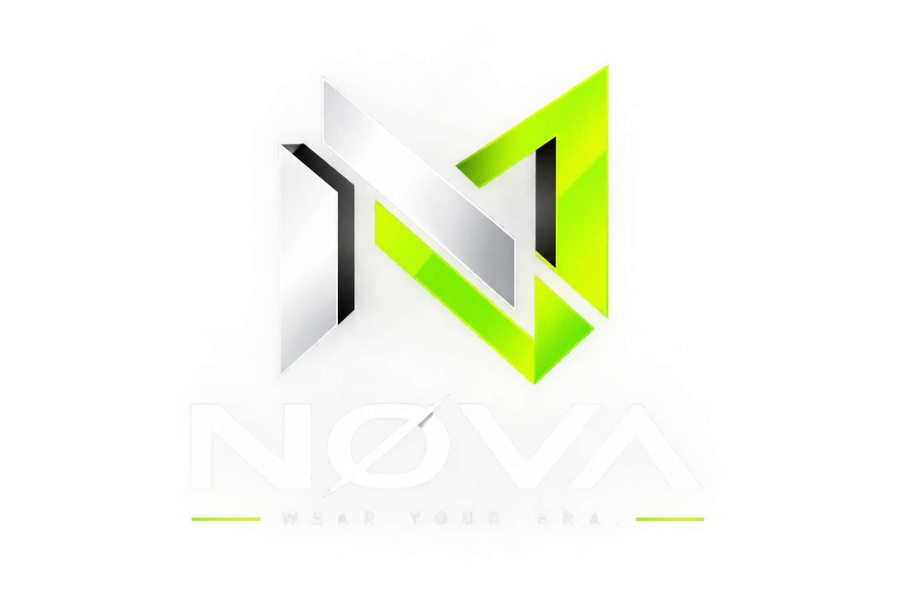

<div align="center">



# NØVA

### Premium Fashion E-Commerce Platform

A modern full-stack fashion e-commerce platform built with **React, TypeScript, Python, Django, and Django REST Framework**.

<br />

[](https://nova-fashion-house.vercel.app/)
[](https://nova-backend-hg36.onrender.com/api/products/)
[](https://github.com/abhinavas-10/NOVA)

</div>

---

# ✨ Overview

**NØVA** is a modern full-stack fashion e-commerce platform focused on premium streetwear and contemporary fashion.

Users can explore collections, discover new drops, view detailed products, select sizes and colors, manage their wishlist and shopping cart, authenticate their accounts, and manage orders.

The application uses a **React + TypeScript frontend** connected to a **Python Django REST API backend**, providing dynamic product data and e-commerce functionality.

---

# 🌐 Live Demo

| Service | Link |
|---|---|
| 🛍️ **Live Website** | [nova-fashion-house.vercel.app](https://nova-fashion-house.vercel.app/) |
| ⚙️ **Backend API** | [Render API](https://nova-backend-hg36.onrender.com/api/products/) |

---

# 🛍️ Features

## Product Experience

- Premium fashion product catalog
- Men's collection
- Women's collection
- Unisex collection
- Streetwear collection
- Sneakers collection
- Accessories collection
- New Drops section
- Coming Soon products
- Product search and filtering
- Product detail pages
- Product image gallery
- Hover image preview
- Product variants
- Size and color selection

## User Features

- 🔐 User authentication
- ❤️ Wishlist management
- 🛒 Shopping cart
- ➕ Add and remove products
- 🔢 Quantity management
- 📦 Order management

---

# 🧰 Tech Stack

## Frontend

| Technology | Purpose |
|---|---|
| React | User Interface |
| TypeScript | Type Safety |
| Vite | Frontend Build Tool |
| Tailwind CSS | Styling |
| TanStack Router | Client-side Routing |
| Lucide React | Icons |

## Backend

| Technology | Purpose |
|---|---|
| Python | Backend Programming Language |
| Django | Web Framework |
| Django REST Framework | REST API Development |
| JWT | Authentication |
| Gunicorn | Production Server |

## Database & Storage

| Technology | Purpose |
|---|---|
| MySQL | Local Development Database |
| PostgreSQL | Production Database |
| Cloudinary | Product Image Storage |

## Deployment

| Platform | Purpose |
|---|---|
| Vercel | Frontend Deployment |
| Render | Backend Deployment |
| GitHub | Version Control |

---

# 🏗️ Architecture

```text
                         ┌───────────────────────┐
                         │     NØVA FRONTEND     │
                         │                       │
                         │   React + TypeScript   │
                         │   Vite + Tailwind CSS  │
                         └───────────┬───────────┘
                                     │
                                     │ REST API
                                     ▼
                         ┌───────────────────────┐
                         │     PYTHON BACKEND    │
                         │                       │
                         │   Python + Django     │
                         │ Django REST Framework │
                         │   JWT Authentication  │
                         └───────────┬───────────┘
                                     │
                  ┌──────────────────┼──────────────────┐
                  │                  │                  │
                  ▼                  ▼                  ▼
          ┌──────────────┐   ┌──────────────┐   ┌──────────────┐
          │ PostgreSQL   │   │  Cloudinary  │   │ Authentication│
          │ Production DB│   │ Image Storage│   │    & Users    │
          └──────────────┘   └──────────────┘   └──────────────┘
